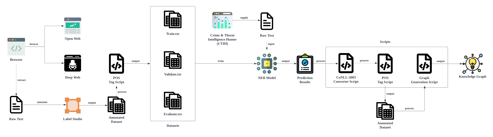
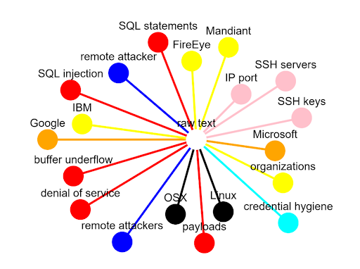

# CybNER
CybNER is a command-line tool that aids in using the trained AllenNLP model developed by the team for Named Entity Recognition (NER) in the Cybersecurity Domain. CybNER provides extensive features which include dataset encoding error checks, CSV - JSON raw text conversion, training and prediction of model, automation annotation on Part-of-Speech(POS) tag or Named Entity tag and generation of an interactive web-based knowledge graph.
## Requirements
- Python3
## Installation and Setup 
 ```bash
git clone https://github.com/Lyc4on/Cybersecurity-NER.git
pip install -r requirements.txt
```
## System Architecture
The diagram below depicts the overall architecture of the system, beginning from the collection of cybersecurity related raw text to the training and usage of the AllenNLP model. Take note that in this diagram, The Cyber Threat intelligence Hunter (CTIH), a application from Singapore Institute of Technology (SIT), which utlises the model for prediction would not be featured in the repository.



## Usage
```bash
# perform checks for encoding errors on a user specified dataset in CoNLL-2003 format, example.conll.
python analyse.py -dc -f "example.conll"

#perform conversion of user specified raw text file, named raw_text.csv to JSON format for prediction purpose.
python analyse.py -co -f "raw_text.csv"

#perform automated annotation of POS tag on a user specified dataset in CoNLL-2003 format.
#The output will be example.conll-POS for this example.
python analyse.py -pos -f "example.conll"

#perform training on the AllenNLP model with the user specified configuration file named config.json.
# mode = 1 - perform train and overwrite output directory
python analyse.py -t 1 -c "config.json"

#perform prediction with the AllenNLP model by suppying a raw text file named raw_text.json.
# prediction output will be save as prediction.txt
# Automated annotation is achieved by converting prediction.txt to prediction.conll
python analyse.py -p -f "raw_text.json"

#generate a interactive web based knowledge graph with the user specified dataset file named example.conll.
python analyse.py -vg -f "example.conll"

```

```
Command Options:
    -dc         perform checks for encoding errors on user supplied dataset.
    -co         convert a CSV file to a JSON file format for predictions with the model.
    -pos        perform automated annotation of POS tag on user supplied dataset
    -f          inpu the path of the file/dataset required by visual graph, conversion, dataset_check or predict function.
    -t          train the model with a customised config or with the same dataset | - t [1, 2], 1 - train and overwrite the output directory 2 - train and recover from serialization directory.
    -c          input model configuration file to perform training of model.
    -p          perform prediction with the model with the supplied raw text provided by the user | -p [1, 2], 1 - predict from CSV file, 2 - predict from TXT file.
    -vg         generate a interactive web-based knowledge graph based on a dataset in CoNLL-2003 format.
```

## Visualization Graph 
 A interactive knowledge graph can be generated with the use of dash cytoscape and python flask libraries, for a better visualization of cybersecurity terms identified from a raw txt file in CoNLL-2003 format. A example of the interactive knowledge graph based on a small dataset are as shown below:



## Releases
The release section consists of the trained AllenNLP model at https://github.com/Lyc4on/Cybersecurity-NER/releases/download/v1.0.0/AllenNLP_model.tar.gz

